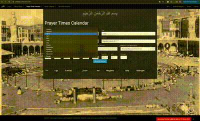
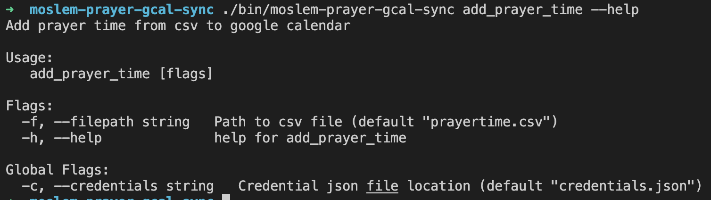
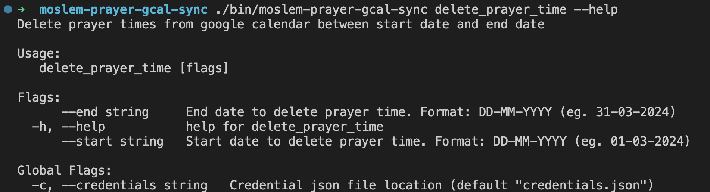

# moslem-prayer-gcal-sync

This is a simple tool to add Islamic prayer times from csv file to Google Calendar. 

Prayer times are not constant everyday, it is to much hustle to setup a recuring event and has to move it once a while because the prayer times are moved earlier/later. You may use this tool to easily generate events.

## Features

The main feature is to add prayer time to Google Calendar from a csv file. Incase you want to deleted the generated Event, you could this tool as well.
- You can select days and prayer times to add.
- The event will be setup for 45 mins and there is reminder 5 mins before the time.
- For friday prayer the event created 30 mins before the time until 1 hour after that.

## Prayer time source

It will use csv with format from https://aladhan.com/calendar, you can choose several parameter from the prayer times. At minimum, the csv file has to have the following items.
- timings.(Fajr|Dhuhr|etc)
- date.gregorian.weekday.en
- date.gregorian.date
- meta.timezone

You can find sample csv file generated by the mentioned web [here](prayertime.csv).



## Credentials
You will need to get the credentials file from Google Console page. Finish the following sections from this [page](https://developers.google.com/calendar/api/quickstart/go) to continue.
- Enable the API
- Configure the OAuth consent screen
- Authorize credentials for a desktop application

## How to run
### Pre-requisite
- golang version 1.22 or latest
- clone the repo to local
- csv file, rename to "prayertime.csv" and move to the repo directory
- credentials file, rename to "credentials,json" and move to the repo directory
- run `make build`

### Add prayer time
Simply run 
```
./bin/moslem-prayer-gcal-sync add_prayer_time
```


 
### Delete prayer time
Choose date range in which you want to delete the prayer times. This tool will only delete Google Event created by it.
```
./bin/moslem-prayer-gcal-sync delete_prayer_time --start <start-date> --end <end-date>
```

